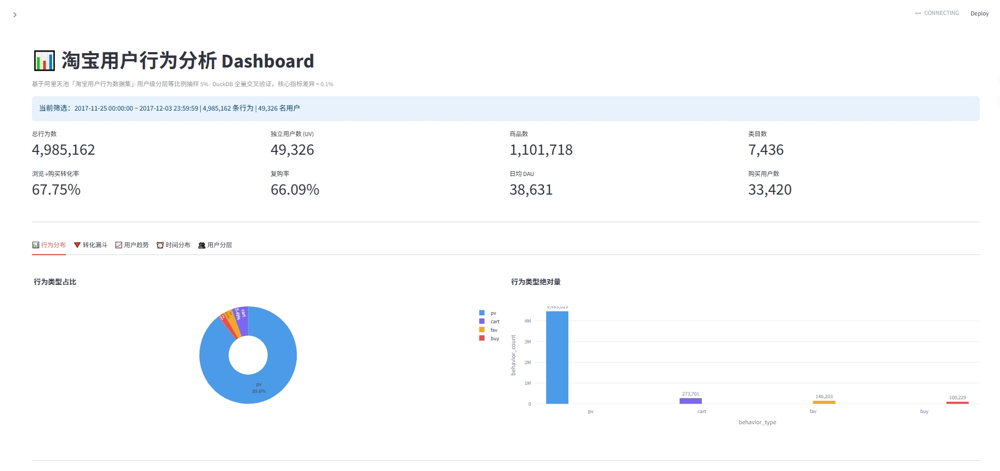

# 淘宝用户行为与转化漏斗分析

基于阿里天池「淘宝用户行为数据集」（1 亿条真实行为记录）的用户行为分析与转化漏斗研究。

**核心产出**：从 1 亿行原始数据出发，通过用户级分层等比例抽样与 SQL 全量交叉验证，还原平台级用户行为规律，识别转化瓶颈与高价值用户画像。

---

## 📂 项目结构

项目分为两个**平级子项目**，用不同工具完成同一份数据分析：

| 目录 | 说明 |
|------|------|
| **[`python/`](python/README.md)** | Python 分析项目（数据管道 + 分析 + 可视化） |
| **[`sql/`](sql/README.md)** | SQL 全量分析项目（DuckDB，零安装） |

---

## 🖥 Dashboard 展示

项目提供两个版本的交互式看板：

| 版本 | 位置 | 特点 |
|------|------|------|
| **Excel** | `python/reports/dashboard.xlsx` | 7 个 Sheet，sparkline 趋势图 |
| **Streamlit** | `python/dashboard/app.py` | 交互式筛选 + 5 个 Tab |

**Streamlit 版预览**：


## 🎯 项目亮点

- **数据规模**：原始数据 100,150,807 行、987,994 名用户
- **抽样设计**：用户级分层等比例抽样（每层抽 5% 用户，保留其全部行为），内存约束下处理约 500 万行
- **分析口径**：区分「用户级漏斗」与「用户-商品级漏斗」，后者才是真实转化效率
- **工程优化**：CSV → Parquet 缓存，处理速度提升 5~10 倍
- **交叉验证**：DuckDB 全量 SQL 与 Python 抽样结果对比，核心指标差异 < 0.1%

---

## 📊 核心发现

### 洞察 1：加购是转化的关键杠杆

| 转化路径 | 转化率 |
|---------|--------|
| 普通浏览 → 购买 | **1.41%** |
| 已加购 → 购买 | **5.98%** |

**加购用户的购买转化率是普通浏览用户的 4 倍**。营销资源应优先投向「促进加购」环节。

### 洞察 2：周末深夜存在购买高峰

- **工作日**：购买分散在全天，无明显峰值
- **周末**：凌晨 2~4 点、早上 6 点出现明显高峰
- 周末的购买用户数和购买行为数均显著高于工作日

### 洞察 3：DAU 在 12-02（周六）出现异常峰值

- 11-25 至 12-01：DAU 稳定在 3.5~3.8 万（抽样数据）
- **12-02：4.7 万（+32%）**
- 购买用户数与购买行为数在 12-02 同步冲顶

---

## 🔬 深化分析

在核心分析之上，新增 5 个深化模块（详见 [`python/README.md`](python/README.md) 的「深化分析」章节）：

| 模块 | 核心结论 |
|------|---------|
| **显著性检验** | 加购 vs 未加购用户购买率差异 +14.8pp（p<0.001）；SQL 全量值全部落在抽样 95% 置信区间内 |
| **RFM 用户分层** | 重要价值客户占 19.4%（平均购买 5.1 次）；未购买用户 32.3% |
| **次日留存** | 基线约 78%；活跃 6~9 天用户留存 88% vs 2~3 天用户 29.5%，分层单调性极强 |
| **用户路径** | 93.4% 浏览无后续；先加购路径购买率 9.44% > 先收藏 7.99% |
| **类目关联规则** | 高支持度规则 lift 最高 5.19（如类目 4159072 → 2885642） |

---

## 🗄 SQL × Python 交叉验证

同一份数据，两种工具，结果高度一致：

| 指标 | Python（抽样 5%） | SQL（全量 1 亿行） | 差异 |
|------|------------------|------------------|------|
| pv 占比 | 89.56% | 89.58% | -0.02% |
| cart 占比 | 5.49% | 5.52% | -0.03% |
| fav 占比 | 2.93% | 2.88% | +0.05% |
| buy 占比 | 2.02% | 2.01% | +0.01% |
| pv→cart 转化率 | 1.07% | 1.07% | **0.00%** |
| pv→buy 转化率 | 1.41% | 1.40% | +0.01% |
| cart→buy 转化率 | 5.98% | 6.06% | -0.08% |
| 复购率 | 65.81% | 66.01% | -0.20% |

**结论**：所有核心指标差异均 < 1%，行为分布与 pv→cart 转化率的差异甚至 < 0.1%，验证了分层等比例抽样方法的正确性。

**用 5% 的数据量（500 万行 / 1 亿行），可以还原出接近全量的分析结论。**

---

## 🚀 快速开始

### 环境准备

```bash
pip install pandas numpy pyarrow matplotlib seaborn duckdb scipy plotly
```

### 数据准备

从[阿里天池](https://tianchi.aliyun.com/dataset/649)下载 `UserBehavior.csv`，放到：

```
raw_users_behavier_date/UserBehavior.csv
```

### 一键运行

```bash
# Python 分析
cd python
python run_all.py

# SQL 全量分析
cd ../sql
python run_sql.py
```

---

## 📖 详细文档

- **Python 分析**：[`python/README.md`](python/README.md)
- **SQL 分析**：[`sql/README.md`](sql/README.md)

---

## 🙏 致谢

本项目的**初始项目结构和分析框架**参考了 GitHub 用户 [@bluesblue320-hue](https://github.com/bluesblue320-hue) 的 [Taobao-User-Behavior-Conversion-Analysis](https://github.com/bluesblue320-hue/Taobao-User-Behavior-Conversion-Analysis) 仓库。

在此基础上做了以下改进：

| 维度 | 原作方案 | 本项目改进 |
|------|---------|-----------|
| 抽样单位 | 行级随机 | **用户级**（保留被抽中用户的全部行为） |
| 分层策略 | 无 | **按用户活跃度分四层** |
| 概率处理 | 等概率 | **分层等比例抽样（每层 5%）** |
| 用户序列完整性 | 平均每用户 1.08 条行为 | **平均每用户约 100 条行为** |
| SQL 方案 | 无 | **DuckDB 全量交叉验证** |
| 可视化 | 少量 | **9 张核心图表** |

> ⚠️ **声明**：本项目为个人学习项目，基于开源仓库修改，非商业用途。原仓库未声明 License，如原作者有异议请联系删除。