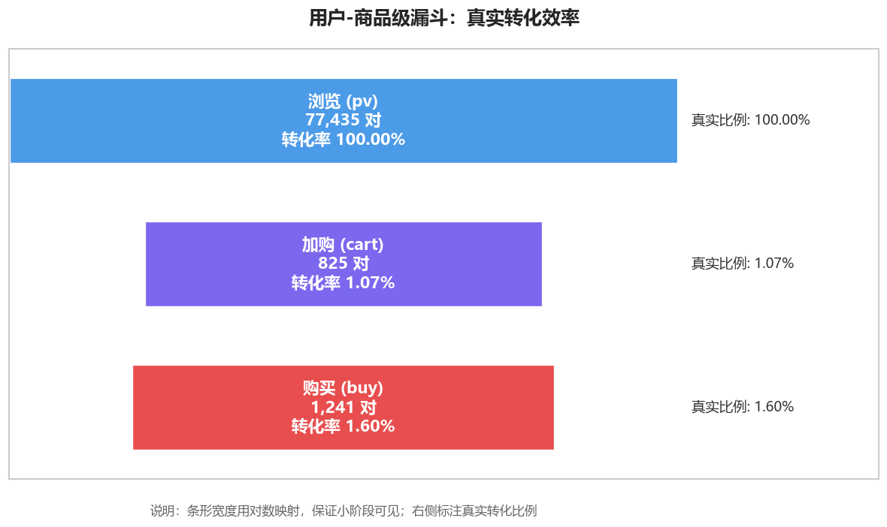
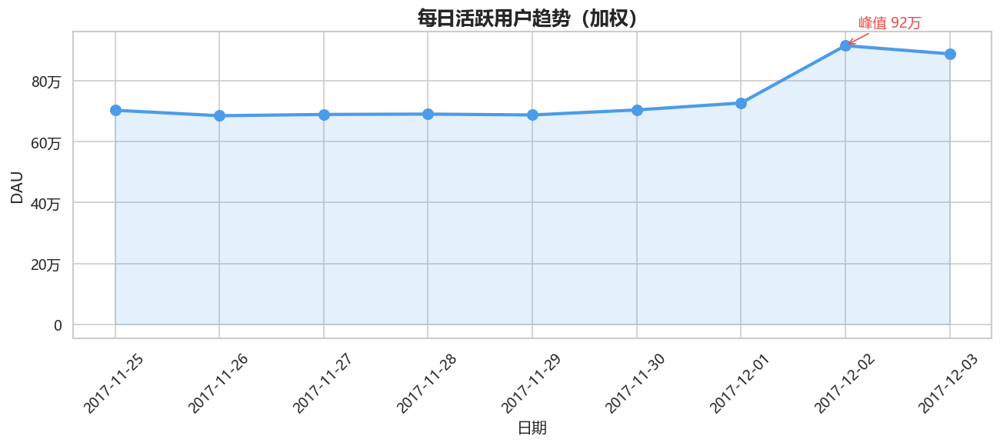
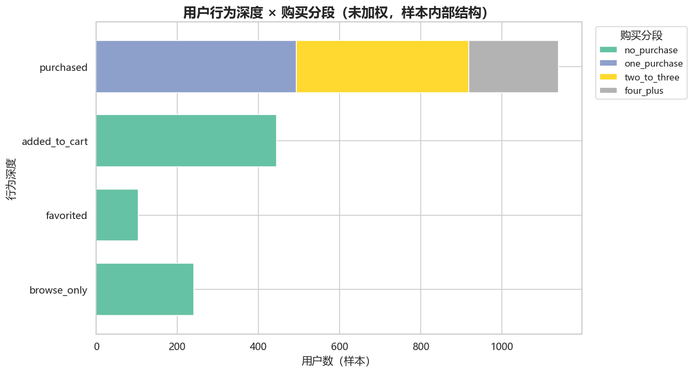
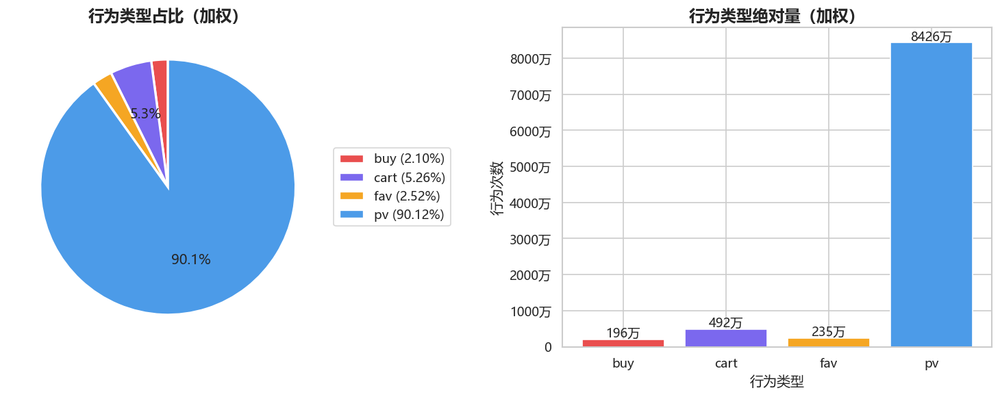

# 淘宝用户行为与转化漏斗分析

基于阿里天池「淘宝用户行为数据集」（1 亿条真实行为记录）的用户行为分析与转化漏斗研究。

**核心产出**：从 1 亿行原始数据出发，通过科学的抽样设计与加权分析，还原平台级用户行为规律，识别转化瓶颈与高价值用户画像。

---

## 📌 项目亮点

- **数据规模**：原始数据 100,150,807 行、987,994 名用户
- **抽样设计**：用户级分层抽样 + 不等概率 + 事后加权，兼顾统计有效性与分层可用性
- **分析口径**：区分「用户级漏斗」与「用户-商品级漏斗」，后者才是真实转化效率
- **工程优化**：CSV → Parquet 缓存，处理速度提升 5~10 倍；全流程可一键复现
- **业务洞察**：识别出加购用户转化率是普通用户的 4 倍、周末深夜购买高峰等可落地规律

---

## 📊 数据集

**来源**：阿里天池「淘宝用户行为数据集」（UserBehavior.csv）

| 项目 | 内容 |
|------|------|
| 时间窗口 | 2017-11-25 ~ 2017-12-03（9 天） |
| 记录数 | 100,150,807 行 |
| 用户数 | 987,994 |
| 商品数 | 约 416 万 |
| 类目数 | 约 9,439 |
| 字段 | `user_id`, `item_id`, `category_id`, `behavior_type`, `timestamp` |
| 行为类型 | pv（浏览）、fav（收藏）、cart（加购）、buy（购买） |

数据为**无表头 CSV**，原始大小约 **3.42 GB**。

---

## 🛠 技术栈

- **Python 3.13**（Anaconda）
- **数据处理**：pandas、numpy、pyarrow
- **可视化**：matplotlib、seaborn
- **存储优化**：Parquet（snappy 压缩）

---

## 🔬 方法论

### 1. 抽样设计

原始数据 1 亿行无法直接分析，需抽样。项目采用**用户级分层不等概率抽样**，共抽取约 10 万条行为记录、1,930 名用户。

#### 分层维度

按用户活跃度（总行为次数）分四层，用分位数切分：

| 层级 | 定义 | 用户数 | 平均行为数 |
|------|------|--------|-----------|
| high | ≥ q90（≥218 次） | 99,475 | ~350 |
| mid | q50~q90（75~217 次） | 398,461 | ~120 |
| low | q10~q50（21~74 次） | 396,623 | ~40 |
| silent | < q10（<21 次） | 93,434 | ~10 |

#### 抽样比例

各层采用**非等概率抽样**，小层比例高、大层比例低：

| 层级 | 抽样比例 | 权重 |
|------|---------|------|
| high | 0.05% | 2000 |
| mid | 0.10% | 1000 |
| low | 0.20% | 500 |
| silent | 0.80% | 125 |

**为什么非等概率？** 若各层等概率抽样（如均为 0.1%），silent 层只能抽到约 93 名用户、930 条行为，样本量不足以做分层分析。通过提高小层抽样率，silent 层提升至约 750 名用户，具备基本统计效力。

#### 用户级抽样

**关键设计**：抽样单位是「用户」，不是「行为行」。一旦用户被抽中，**保留其全部行为记录**。

这一设计解决了常见误区——若按行抽样，10 万条行为只能覆盖约 9 万用户，平均每用户 1.08 条行为，导致：

- ❌ 转化漏斗无法计算（需同一用户多次行为）
- ❌ 复购率几乎为 0
- ❌ 用户行为序列被打散

改用用户级抽样后，平均每用户保留 56 条行为，所有分析口径才成立。

### 2. 事后加权

由于各层抽样率不同，直接汇总会偏向 silent 层（其被抽中概率更高）。因此**每条记录按其层级的抽样率倒数加权**：

$$
\text{weight} = \frac{1}{\text{抽样率}}
$$

加权后所有汇总指标**无偏**，可推断总体。

### 3. 数据清洗

抽样后的数据经过二次清洗：

- 去重（完全重复行）
- 关键列去空
- 行为类型规范化（统一小写、去空格、过滤非法值）
- 时间戳转换（Unix 秒 → datetime）
- 时间范围过滤（限定 2017-11-25 ~ 2017-12-03）
- 类型规范化（ID → int64，行为 → category）

---

## 📈 关键发现

### 洞察 1：加购是转化的关键杠杆

**用户-商品级漏斗**（更严格的转化口径）：

- 普通浏览用户 → 购买：**1.60%**
- 已加购用户 → 购买：**6.34%**

**加购用户的购买转化率是普通浏览用户的 4 倍**。这意味着营销资源应优先投向「促进加购」环节，而非直接促进购买。



### 洞察 2：DAU 在 12-02 出现异常峰值



- 11-25 至 12-01：DAU 稳定在 68~73 万
- **12-02（周六）：91.6 万（+31%）**
- 12-03：88.9 万（回落但未回正常水位）

**推测**：周末效应或促销活动预热。该现象值得进一步排查流量来源。

### 洞察 3：周末深夜存在购买高峰


- **工作日**：购买分散在全天，无明显峰值
- **周末**：凌晨 2~4 点、早上 6 点出现明显高峰

**应用**：营销推送可做「时间分层」，工作日在常规时段投放，周五晚 23:00~周六凌晨 03:00 增加推送频次。

### 洞察 4：用户分层结构



样本内 1,930 名用户中：

| 行为深度 | 用户数 | 占比 |
|---------|--------|------|
| 仅浏览 | 241 | 12.5% |
| 收藏 | 104 | 5.4% |
| 加购未购买 | 445 | 23.1% |
| 已购买 | 1,140 | 59.1% |

**已购买用户中**：

- 单次购买：494 人（43.3%）
- 2~3 次：424 人（37.2%）
- 4 次以上：222 人（19.5%）

**19.5% 的用户贡献了大部分购买量**，是维护核心。

### 洞察 5：行为类型分布



加权还原后的真实行为分布：

| 行为 | 占比 |
|------|------|
| 浏览 (pv) | 90.12% |
| 加购 (cart) | 5.26% |
| 收藏 (fav) | 2.52% |
| 购买 (buy) | 2.10% |

浏览占比超过 90%，购买仅占 2.10%，符合典型的电商「漏斗型」行为分布。

### 其他图表

- [用户级漏斗（覆盖面）](reports/figures/03_user_funnel.png)
- [每日购买趋势](reports/figures/05_purchase_trend.png)
- [行为的小时分布](reports/figures/06_hourly_heatmap.png)
- [购买 TOP10 类目](reports/figures/07_top_categories.png)
- [每日购买时段热力图](reports/figures/09a_purchase_heatmap_by_day.png)
- [工作日 vs 周末热力图](reports/figures/09b_purchase_heatmap_by_weekday.png)
---

## 📂 项目结构

```
python/
├── src/
│   ├── config.py                  # 全局路径配置
│   ├── file_scout.py              # 阶段 1：文件侦察
│   ├── data_prepare.py            # 阶段 2：分层抽样 + 加权
│   ├── data_cleaning.py           # 阶段 3：正式清洗
│   ├── analysis.py                # 阶段 4：核心分析
│   └── visualization.py           # 阶段 5：可视化
│
├── data/
│   ├── UserBehavior.parquet       # Parquet 缓存（加速读取）
│   ├── stratified_data.csv        # 抽样结果（含 weight 列）
│   └── cleaned_stratified_data.csv # 清洗后数据
│
├── reports/
│   └── figures/                   # 10 张可视化图表
│       ├── 01_behavior_distribution.png
│       ├── 02_sequential_funnel.png
│       ├── ...
│       └── 09b_purchase_heatmap_by_weekday.png
│
└── README.md
```

---

## 🚀 如何复现

### 环境准备

```bash
pip install pandas numpy pyarrow matplotlib seaborn
```

### 数据准备

从[阿里天池](https://tianchi.aliyun.com/dataset/649)下载 `UserBehavior.csv`，放到：

```
../raw_users_behavier_date/UserBehavior.csv
```

### 一键运行

```bash
# 进入项目目录
cd python

# 阶段 1：侦察原始数据（可选）
python src/file_scout.py

# 阶段 2：分层抽样（首次约 5 分钟，之后走 Parquet 缓存约 1 分钟）
python src/data_prepare.py

# 阶段 3：正式清洗
python src/data_cleaning.py

# 阶段 4：分析
python src/analysis.py

# 阶段 5：可视化
python src/visualization.py
```

跑完后图表在 `reports/figures/`，数据在 `data/`。

### 参数调整

所有路径集中在 `src/config.py`：

```python
PROJECT_ROOT = Path(r"你的项目路径")
DATA_DIR = PROJECT_ROOT / "data"
FIG_DIR = PROJECT_ROOT / "reports" / "figures"
```

抽样比例在 `src/data_prepare.py`：

```python
USER_SAMPLE_RATIOS = {
    "high":   0.0005,
    "mid":    0.001,
    "low":    0.002,
    "silent": 0.008,
}
```

## 🔍 可改进方向

1. **时间维度分层**：当前按天分层的权重未细化到「天 × 层」，未来可做更精细的时间加权
2. **用户画像**：结合用户所属商品类目偏好做聚类，识别不同价值人群
3. **A/B 测试框架**：将漏斗分析改为可支持因果推断的实验框架
4. **实时化**：将批处理管道改造为流式（Kafka + Flink）
5. **可视化交互**：用 Streamlit 做交互式 Dashboard


---

## 📧 联系

如有问题或建议，欢迎通过 GitHub Issues 反馈。