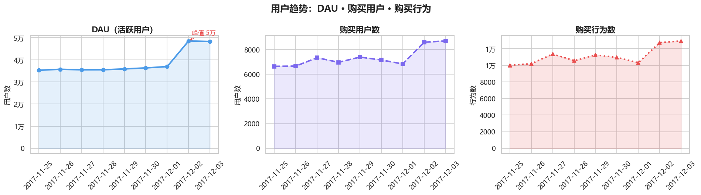
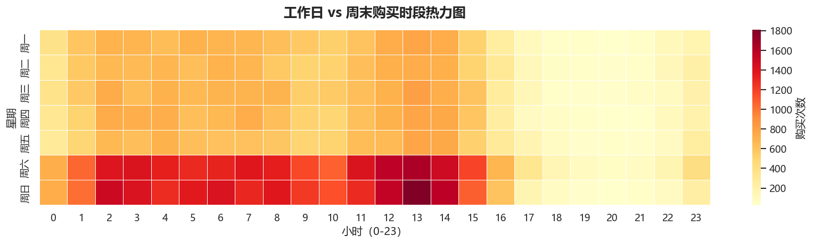
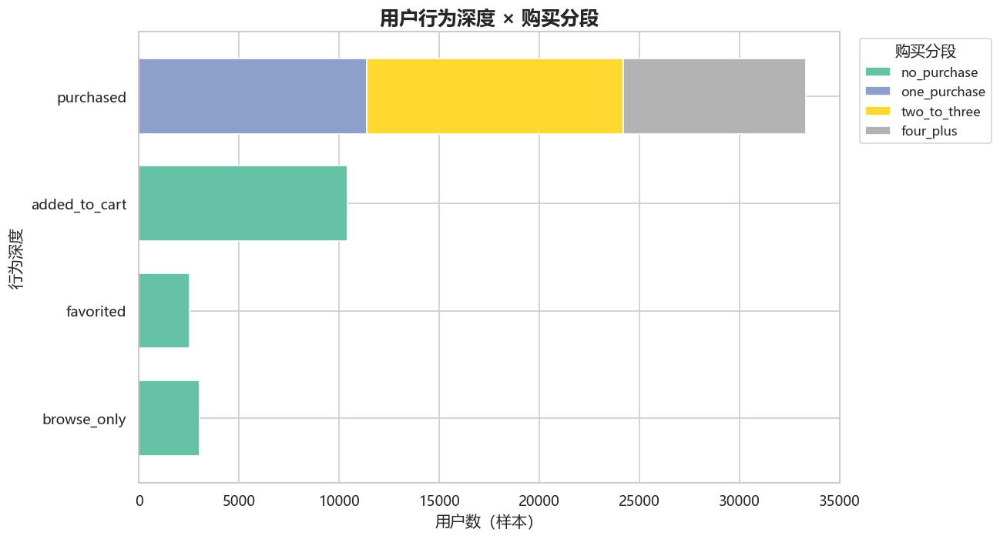

# 淘宝用户行为与转化漏斗分析（Python）

基于阿里天池「淘宝用户行为数据集」（1 亿条真实行为记录）的用户行为分析与转化漏斗研究。

**核心产出**：从 1 亿行原始数据出发，通过用户级分层等比例抽样与 SQL 全量交叉验证，还原平台级用户行为规律，识别转化瓶颈与高价值用户画像。

---

## 📌 项目亮点

- **数据规模**：原始数据 100,150,807 行、987,994 名用户
- **抽样设计**：在 4-6 GB 内存约束下，采用用户级分层等比例抽样（每层抽 5% 用户），处理约 500 万行
- **分析口径**：区分「用户级漏斗」与「用户-商品级漏斗」，后者才是真实转化效率
- **工程优化**：CSV → Parquet 缓存，处理速度提升 5~10 倍；全流程可一键复现
- **交叉验证**：DuckDB 全量 SQL 与 Python 抽样结果对比，核心指标差异 < 0.1%

---

## 📊 数据集

**来源**：阿里天池「淘宝用户行为数据集」（UserBehavior.csv）

| 项目 | 内容 |
|------|------|
| 时间窗口 | 2017-11-25 ~ 2017-12-03（9 天） |
| 记录数 | 100,150,807 行 |
| 用户数 | 987,994 |
| 商品数 | 约 416 万 |
| 类目数 | 约 9,439 |
| 字段 | `user_id`, `item_id`, `category_id`, `behavior_type`, `timestamp` |
| 行为类型 | pv（浏览）、fav（收藏）、cart（加购）、buy（购买） |

数据为**无表头 CSV**，原始大小约 **3.42 GB**。

---

## 🛠 技术栈

- **Python 3.13**（Anaconda）
- **数据处理**：pandas、numpy、pyarrow
- **可视化**：matplotlib、seaborn
- **SQL 引擎**：DuckDB（零安装、直接读 Parquet）
- **存储优化**：Parquet（snappy 压缩）

---

## 🔬 方法论

### 1. 抽样设计

**环境约束**：本地开发机内存 4-6 GB。pandas 在处理 1 亿行 × 5 列的 CSV 时，内存占用约 6~10 GB，会直接爆内存。因此需要把数据压缩到**约 500 万行**（原始数据的 5%）以内。

**方法**：用户级分层等比例抽样——按用户活跃度分四层，每层抽取相同比例（5%）的用户，保留被抽中用户的全部行为记录。

#### 分层维度

按用户活跃度（总行为次数）分四层，用分位数切分：

| 层级 | 定义 | 用户数 | 平均行为数 |
|------|------|--------|-----------|
| high | ≥ q90（≥218 次） | 99,475 | ~350 |
| mid | q50~q90（75~217 次） | 398,461 | ~120 |
| low | q10~q50（21~74 次） | 396,623 | ~40 |
| silent | < q10（<21 次） | 93,434 | ~10 |

#### 抽样比例

各层**统一抽 5% 用户**（等比例抽样）：

| 层级 | 用户数 | 抽样比例 | 抽中用户 | 预计抽样行数 |
|------|--------|---------|---------|-------------|
| high | 99,475 | 5% | ~4,970 | ~175 万 |
| mid | 398,461 | 5% | ~19,920 | ~240 万 |
| low | 396,623 | 5% | ~19,830 | ~80 万 |
| silent | 93,434 | 5% | ~4,670 | ~5 万 |
| **合计** | 987,993 | **5%** | **~49,400** | **~500 万** |

#### 用户级抽样（关键设计）

**抽样单位是「用户」，不是「行为行」**。一旦用户被抽中，**保留其全部行为记录**。

这一设计解决了常见误区——若按行抽样，10 万条行为只能覆盖约 9 万用户，平均每用户 1.08 条行为，导致：

- ❌ 转化漏斗无法计算（需同一用户多次行为）
- ❌ 复购率几乎为 0
- ❌ 用户行为序列被打散

改用用户级抽样后，平均每用户保留约 **100 条行为**，所有分析口径才成立。

#### 为什么用等比例抽样

各层抽样率相同 → 样本是总体的"等比缩小版" → **直接汇总即为无偏估计**，无需事后加权。

### 2. 数据清洗

抽样后的数据经过二次清洗：

- 去重（完全重复行）
- 关键列去空
- 行为类型规范化（统一小写、去空格、过滤非法值）
- 时间戳转换（Unix 秒 → datetime）
- 时间范围过滤（限定 2017-11-25 ~ 2017-12-03）
- 类型规范化（ID → int64，行为 → category，内存优化）

---

## 📈 关键发现

### 洞察 1：加购是转化的关键杠杆

**用户-商品级漏斗**（更严格的转化口径：同一用户在同一商品上的先后行为）：

| 阶段 | 数量 | 转化率 |
|------|------|--------|
| 浏览 (pv) | 3,493,068 对 | 100.00% |
| 加购 (cart) | 37,228 对 | **1.07%** |
| 购买 (buy) | 49,091 对 | **1.41%** |

**关键洞察**：
- 普通浏览用户 → 购买：**1.41%**
- 已加购用户 → 购买：**5.98%**
- **加购用户的购买转化率是普通浏览用户的 4 倍**

**商业应用**：营销资源应优先投向「促进加购」环节（如加购有礼、加购提醒），而非直接促进购买。


### 洞察 2：DAU 在 12-02 出现异常峰值



- 11-25 至 12-01：DAU 稳定在 3.5~3.8 万（抽样）
- **12-02（周六）：4.7 万（+32%）**
- 12-03：4.6 万（回落但未回正常水位）
- **购买用户数与购买行为数在 12-02 同步冲顶**

**推测**：周末效应或促销活动预热。该现象值得进一步排查流量来源。

### 洞察 3：周末深夜存在购买高峰



- **工作日**：购买分散在全天，无明显峰值
- **周末**：凌晨 2~4 点、早上 6 点出现明显高峰
- **周末的购买量显著高于工作日**

**应用**：营销推送可做「时间分层」，工作日在常规时段投放，周五晚 23:00~周六凌晨 03:00 增加推送频次。

### 洞察 4：用户分层结构



样本内约 4.9 万用户中：

| 行为深度 | 用户数（样本） | 占比 |
|---------|--------------|------|
| 已购买 | 33,337 | 67.8% |
| 加购未购买 | 10,416 | 21.1% |
| 仅浏览 | 3,033 | 6.2% |
| 仅收藏 | 2,540 | 5.2% |

**已购买用户中**：
- 单次购买：11,398 人（34.2%）
- 2~3 次：12,786 人（38.4%）
- 4 次以上：9,153 人（27.5%）

**约 27.5% 的高价值用户贡献了大部分购买量**，是维护核心。

### 洞察 5：行为类型分布


Python 抽样结果：

| 行为 | 占比 |
|------|------|
| 浏览 (pv) | 89.56% |
| 加购 (cart) | 5.49% |
| 收藏 (fav) | 2.93% |
| 购买 (buy) | 2.02% |

浏览占比接近 90%，购买仅占 2%，符合典型的电商「漏斗型」行为分布。

### 其他图表

- [用户级漏斗（覆盖面）](reports/figures/03_user_funnel.png)
- [行为的小时分布](reports/figures/05_hourly_heatmap.png)
- [购买 TOP10 类目](reports/figures/06_top_categories.png)
- [每日购买时段热力图](reports/figures/08a_purchase_heatmap_by_day.png)

---

## 📂 项目结构

```
python/
├── src/
│   ├── config.py                  # 全局路径配置
│   ├── file_scout.py              # 阶段 1：文件侦察
│   ├── data_prepare.py            # 阶段 2：分层等比例抽样
│   ├── data_cleaning.py           # 阶段 3：正式清洗
│   ├── analysis.py                # 阶段 4：核心分析（13 个函数）
│   └── visualization.py           # 阶段 5：可视化（9 张图表）
│
├── data/
│   ├── UserBehavior.parquet       # Parquet 缓存（加速读取）
│   ├── stratified_data.csv        # 抽样结果（约 500 万行）
│   └── cleaned_stratified_data.csv # 清洗后数据
│
├── reports/
│   └── figures/                   # 9 张可视化图表
│       ├── 01_behavior_distribution.png
│       ├── 02_sequential_funnel.png
│       ├── 03_user_funnel.png
│       ├── 04_user_trend.png
│       ├── 05_hourly_heatmap.png
│       ├── 06_top_categories.png
│       ├── 07_user_segmentation.png
│       ├── 08a_purchase_heatmap_by_day.png
│       └── 08b_purchase_heatmap_by_weekday.png
│
├── run_all.py                     # 一键运行完整管道
└── README.md
```

---

## 🚀 如何复现

### 环境准备

```bash
pip install pandas numpy pyarrow matplotlib seaborn duckdb scipy plotly
```

### 数据准备

从[阿里天池](https://tianchi.aliyun.com/dataset/649)下载 `UserBehavior.csv`，放到：

```
../raw_users_behavier_date/UserBehavior.csv
```

### 一键运行

```bash
cd python
python run_all.py
```

### 分步运行

```bash
python src/file_scout.py       # 1. 侦察原始数据（可选）
python src/data_prepare.py     # 2. 分层抽样（首次约 5 分钟）
python src/data_cleaning.py    # 3. 正式清洗
python src/analysis.py         # 4. 核心分析
python src/visualization.py    # 5. 可视化
```

跑完后图表在 `reports/figures/`，数据在 `data/`。

### 参数调整

所有路径集中在 `src/config.py`：

```python
PROJECT_ROOT = Path(r"你的项目路径")
DATA_DIR = PROJECT_ROOT / "data"
FIG_DIR = PROJECT_ROOT / "reports" / "figures"
```

目标行数在 `src/data_prepare.py`：

```python
# 环境约束：4-6 GB 内存 → 约 500 万行上限
TARGET_ROWS = 5_000_000
```

**调整建议**：

| 你的内存 | 建议 `TARGET_ROWS` | 抽样率 |
|---------|-------------------|--------|
| 8 GB 以上 | 10,000,000 | 10% |
| **4-6 GB（默认）** | **5,000,000** | **5%** |
| 4 GB 以下 | 3,000,000 | 3% |
| **不想抽样** | — | 直接用 [`sql/`](../sql/) 的 DuckDB 方案，全量分析无需加载到内存 |

**注意**：调整 `TARGET_ROWS` 后需要删掉 `data/` 下的缓存文件重新跑，否则会用旧结果。
---

## 🖥 交互式 Dashboard

项目提供两个版本的 Dashboard，覆盖不同的使用场景。

### Excel 版（静态）

- **位置**：`reports/dashboard.xlsx`
- **生成**：`python dashboard/build_dashboard.py`
- **内容**：7 个 Sheet，含核心 KPI、行为分布、转化漏斗、用户趋势、时间分布、用户分层、类目 TOP10
- **特点**：sparkline 趋势图、卡片式 KPI 布局，业务方可直接打开使用

### Streamlit 版（交互式）


- **入口**：`dashboard/app.py`
- **本地运行**：

```bash
pip install streamlit plotly
streamlit run dashboard/app.py
```

浏览器打开 `http://localhost:8501`。

**核心功能**：

| 功能 | 说明 |
|------|------|
| 侧边栏筛选 | 按日期范围、行为类型实时筛选，所有图表联动更新 |
| 5 个 Tab | 行为分布 / 转化漏斗 / 用户趋势 / 时间分布 / 用户分层 |
| Plotly 交互 | 悬停查看数值、框选缩放、双击重置 |
| 数据缓存 | `@st.cache_data` 只加载一次，Tab 切换秒响应 |
| KPI 卡片 | 8 个核心指标（规模 + 效率） |

**为什么做两个版本**：

- **Excel**：给业务方交付，无需编程环境
- **Streamlit**：给技术同学演示，可交互探索

---

## 📊 Dashboard 展示

### 核心指标一览

| 类别 | 指标 | 数值 |
|------|------|------|
| **数据规模** | 总行为数 | 4,985,162 |
| | 独立用户数 | 49,326 |
| | 商品数 | 1,101,718 |
| | 类目数 | 7,436 |
| **效率指标** | 加购→购买转化率 | 5.99% |
| | 复购率 | 66.09% |
| | 日均 DAU | 38,631 |
| | 购买用户数 | 33,420 |
---

## 🔬 深化分析（2026-09 新增）

在原有漏斗与复购分析之上，新增 5 个深化模块（分析函数在 `src/analysis.py` 第 14~18 节，图表在 `src/visualization.py` 图 9~13，结果输出到 `reports/`，随 `run_all.py` 一键管道执行）：

### 1. 显著性检验完整版（analysis.py §14）

- **两比例 z 检验**：加购用户购买率 71.58% vs 未加购用户 56.77%，差异 +14.81pp（z=30.8，p<0.001），「促进加购」的结论首次具备统计显著性支撑；收藏 vs 未收藏差异 +4.63pp（z=10.8，p<0.001）同样显著
- **抽样置信区间验证**：对 buy 占比、pv→buy、cart→buy、复购率计算 Wilson 95% 置信区间，**SQL 全量值全部落在抽样区间内**（如 cart→buy 抽样 5.99%，CI [5.90%, 6.08%]，全量 6.06%），抽样方法再次得到验证
- **DAU 峰值分析**：仅 9 个数据点不做 z-score，改用工作日/周末分组对比 + 基线提升：12-02 DAU 较基线（11-25~12-01 均值 35,852）提升 **+35.2%**，购买用户数提升 +22.8%
- 产出：`reports/significance_tests.json` + `figures/09a_significance_ci.png`、`figures/09b_dau_weekday_weekend.png`

### 2. RFM 用户分层（analysis.py §15）

- 无金额维度，做 **RF 两维打分**；9 天窗口下 R 天粒度粗（大量用户末日购买），按窗口手工分箱而非 30 天经典阈值
- 购买用户划分为 6 个层级 + 未购买用户单独一类：**重要价值客户 9,562 人（19.4%）**，平均购买 5.1 次、平均 R 0.4 天；未购买用户占 32.3%
- 产出：`reports/rfm_segments.csv` + `figures/10a_rfm_segments.png`、`figures/10b_rfm_matrix.png`

### 3. 次日留存分析（analysis.py §16）

- 9 天窗口缩水版：只做**次日留存**（7 日留存样本太薄、30 日做不了）
- 基线次日留存约 **78%**；12-01→12-02 跳升至 98.3%，印证 12-02 DAU 异常是「老用户几乎全部回流 + 大量新用户」
- **活跃分层单调性极强**：窗口内活跃 6~9 天的用户次日留存 88.0%，4~5 天 59.2%，2~3 天 29.5%
- 产出：`reports/retention_summary.csv` + `figures/11_retention_overview.png`

### 4. 用户路径分析（analysis.py §17）

- 用户-商品级三段路径归类（首次行为时间排序，平局按 pv<fav<cart<buy 次序打破）+ **plotly 交互式桑基图**
- 93.4% 的浏览无后续行为；「先加购」路径购买率 **9.44%** > 「先收藏」**7.99%**；「直接购买」仅占浏览对的 1.38%
- 产出：`reports/path_summary.csv` + `figures/12_path_sankey.html`（浏览器打开可交互）

### 5. 类目级关联规则挖掘（analysis.py §18）

- **技术红线**：商品 ID 脱敏且数据稀疏，商品级 Apriori（support=0.01）挖不出任何规则、稠密 one-hot 会 OOM——因此按 `category_id` 聚合购物篮，做**精确 2-项集计数**（结果等价于 FP-Growth 的 2-项集，无需稠密矩阵）
- 20,970 个有效购物篮（购买 ≥2 类目）；高支持度规则如「类目 4159072 → 2885642」：支持度 0.87%、置信度 27.6%、**lift 5.19**；长尾高 lift 规则（lift>100）支持度极低，仅作参考
- 产出：`reports/association_rules.csv` + `figures/13a_association_scatter.png`、`figures/13b_association_top_rules.png`

---

## 🔍 可改进方向

1. ~~**用户画像**~~ → ✅ 已完成 RFM 分层（见上文深化分析）；后续可结合类目偏好做聚类
2. ~~**可视化交互**~~ → ✅ 已完成 Streamlit Dashboard 与路径桑基图
3. **A/B 测试框架**：将漏斗分析改为可支持因果推断的实验框架（基于历史数据模拟）
4. **实时化**：将批处理管道改造为流式（Kafka + Flink）
5. **关联规则下钻**：类目级规则已跑通，可尝试 FP-Growth 挖 ≥3 项集并结合用户分层对比
6. **时间维度分层**：当前按天分层的权重未细化到「天 × 层」，未来可做更精细的时间加权

---

## 🗄 SQL 交叉验证

除 Python 外，项目在 [`../sql/`](../sql/) 目录下提供**同等功能的 SQL 全量分析方案**（基于 DuckDB，零安装），覆盖行为分布、转化漏斗、复购、用户分层等全部核心分析。

### 核心指标对比

| 指标 | Python（抽样 5%） | SQL（全量 1 亿行） | 差异 |
|------|------------------|------------------|------|
| **行为分布** | | | |
| pv 占比 | 89.56% | 89.58% | -0.02% |
| cart 占比 | 5.49% | 5.52% | -0.03% |
| fav 占比 | 2.93% | 2.88% | +0.05% |
| buy 占比 | 2.02% | 2.01% | +0.01% |
| **用户级漏斗转化率** | | | |
| 浏览 → 收藏 | 39.79% | 39.61% | +0.18% |
| 浏览 → 加购 | 74.21% | 75.09% | -0.88% |
| 浏览 → 购买 | 67.82% | 68.33% | -0.51% |
| **用户-商品级漏斗** | | | |
| pv→cart 转化率 | 1.07% | 1.07% | **0.00%** |
| pv→buy 转化率 | 1.41% | 1.40% | +0.01% |
| cart→buy 转化率 | 5.98% | 6.06% | -0.08% |
| **复购分析** | | | |
| 复购率 | 65.81% | 66.01% | -0.20% |
| **用户分层** | | | |
| 已购买 | 67.8% | 68.06% | -0.26% |
| 加购未购买 | 21.1% | 21.04% | +0.06% |
| 仅浏览 | 6.2% | 6.03% | +0.17% |
| 仅收藏 | 5.2% | 4.87% | +0.33% |

**结论**：所有核心指标的差异均 < 1%，行为分布与 pv→cart 转化率的差异甚至 < 0.1%，验证了用户级分层等比例抽样方法的正确性。

**这证明了：用 5% 的数据量（500 万行 / 1 亿行），可以还原出接近全量的分析结论。**

### 为什么做 SQL 版本

- **场景互补**：SQL 适合全量数据、批量统计；Python 适合可视化和建模
- **交叉验证**：同一份数据用两种工具跑，结果一致说明分析可信

---

## 🙏 致谢

本项目的**初始项目结构和分析框架**参考了 GitHub 用户 [@bluesblue320-hue](https://github.com/bluesblue320-hue) 的 [Taobao-User-Behavior-Conversion-Analysis](https://github.com/bluesblue320-hue/Taobao-User-Behavior-Conversion-Analysis) 仓库。

在此基础上进行了以下改进：

| 维度 | 原作方案 | 本项目改进 |
|------|---------|-----------|
| 抽样单位 | 行级随机 | **用户级**（保留被抽中用户的全部行为） |
| 分层策略 | 无 | **按用户活跃度分四层**（high / mid / low / silent） |
| 概率处理 | 等概率 | **分层等比例抽样（每层 5%）** |
| 用户序列完整性 | 平均每用户 1.08 条行为 | **平均每用户约 100 条行为** |
| SQL 方案 | 无 | **DuckDB 全量交叉验证** |
| 可视化 | 少量 | **9 张核心图表** |
| 文档 | 简略 | **完整方法论说明 + 数据管道文档** |

> ⚠️ **声明**：本项目为个人学习项目，基于开源仓库修改，非商业用途。原仓库未声明 License，如原作者有异议请联系删除。